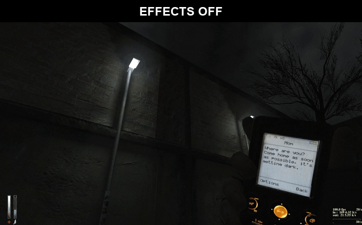
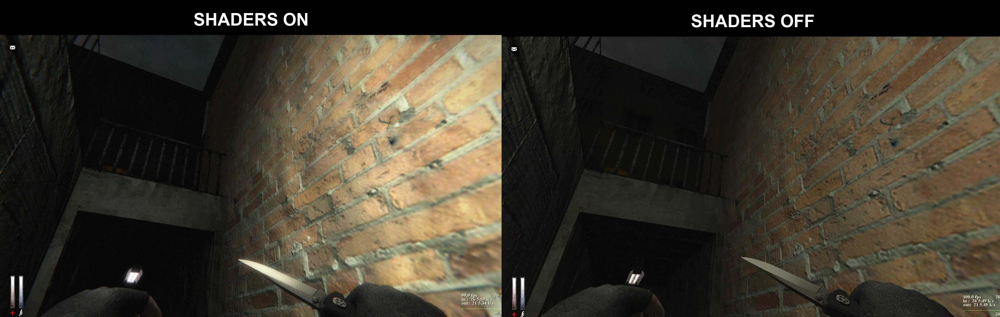
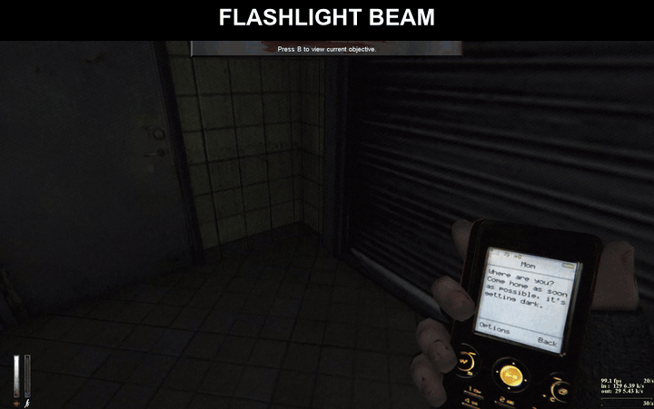
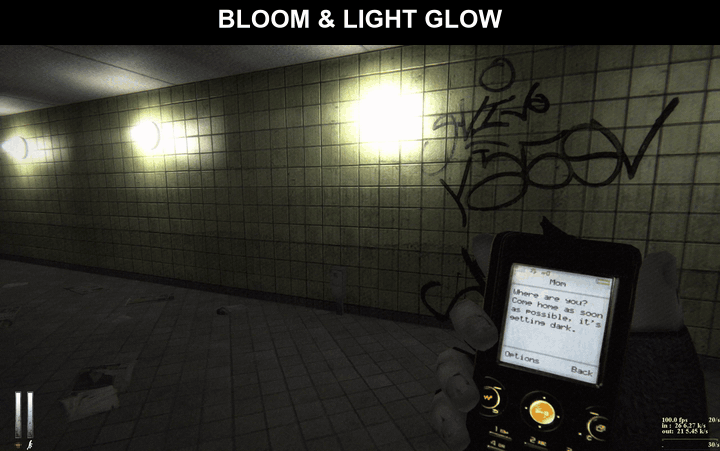
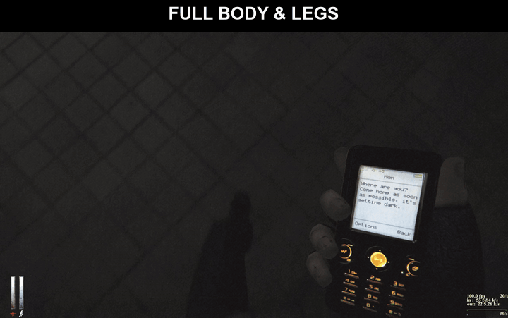
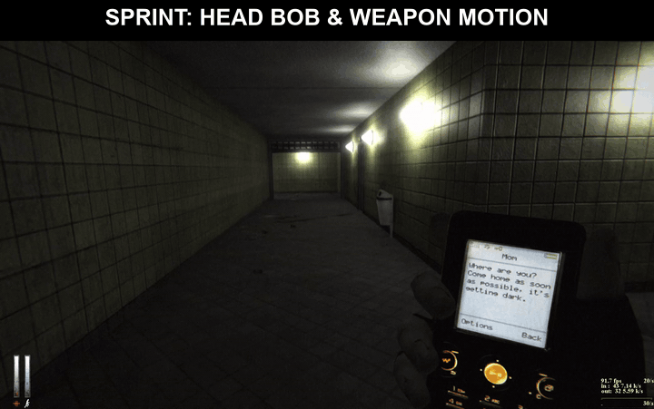
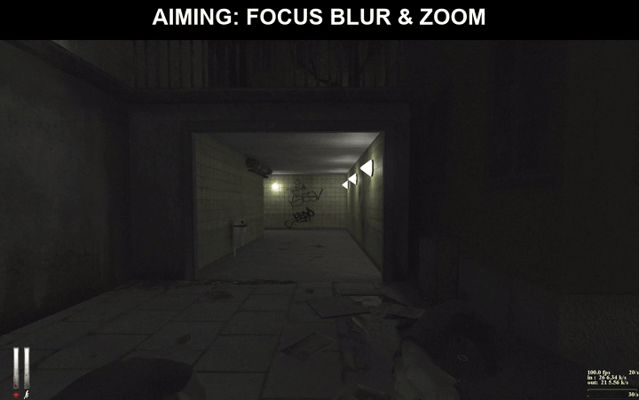

# Cry of Fear: First-Person Overhaul

A client-side mod for **Cry of Fear** (Steam). It adds:
- **Full body:** Simon's body and legs in first person.
- **Camera feel:** head bob, footstep impacts, view lag and leaning.
- **Weapon handling:** sway, breathing, and reactions to sprinting, jumping, firing and reloading.
- **Graphics overhaul:** ambient occlusion, bloom, light shafts, a volumetric flashlight beam, depth of field, motion blur, colour grading, anti-aliasing and more.

Singleplayer only. Only `cryoffear\cl_dlls\client.dll` is replaced, and the original is kept. No game files are included in this repository.

## Showcase





<table>
  <tr>
    <td></td>
    <td></td>
  </tr>
  <tr>
    <td></td>
    <td></td>
  </tr>
  <tr>
    <td></td>
    <td></td>
  </tr>
</table>

## Install
1. Download the latest release zip from the **Releases** page (or clone this repo).
2. Extract the folder **into your Cry of Fear folder**, next to `cof.exe`. To find it: Steam → right-click Cry of Fear → Manage → Browse local files.
3. Run **`install.bat`**. If Windows refuses, right-click → *Run as administrator*.
4. Start Cry of Fear from Steam as usual.

`install.bat` also works from anywhere if Cry of Fear is in the default Steam folder. You can also pass the path: `install.bat "D:\SteamLibrary\steamapps\common\Cry of Fear"`.

**Uninstall:** run `uninstall.bat`, or use Steam → *Verify integrity of game files*.

**Updating:** run `install.bat` again; it keeps your settings. Use `install.bat reset` to go back to the default settings.

**Switching between versions:** `Play Modded.bat` and `Play Normal.bat` switch between the modded and original game and launch it.

## Features

**Body**
- Simon's own model, with the head and arms hidden in first person.
- Walk, run, crouch and jump animations matched to your real speed.
- Legs turn toward the direction you're moving.
- Hidden automatically in cutscenes, on ladders and in third person.

**Camera**
- Head bob and sway in step with your footsteps, plus impacts on each step and on landing.
- Slight view lag on fast turns.
- Leaning into strafes and turns.
- Horizon lock and look-up/down limits.

**Hands and weapon**
- Inertia sway with spring-back.
- Idle breathing.
- Sprint lowering, airborne float, landing dip, fire kick and reload offset.
- Field of view widens while sprinting and narrows while aiming.

**Graphics** (GLSL, about 3 ms per frame at 1080p on an RTX 3050)
- **Lighting and shadows:** ambient occlusion, contact shadows and bounce light.
- **Atmosphere:** depth fog, a volumetric flashlight beam that follows the light in your hand, and light shafts.
- **Glow and lens:** bloom with lens dirt.
- **Blur:** motion blur, and depth of field while aiming.
- **Image and colour:** filmic highlights, eye adaptation, colour grade, film grain, vignette and chromatic aberration.
- **Damage:** a red pulse when you're hit.
- **Quality:** FXAA anti-aliasing and sharpening.

## Settings
Open the console (`~`) and type a command. Settings are saved in `cryoffear\fpbody.cfg`.

| Quick switches | |
|---|---|
| `cl_fpbody 0/1` | body |
| `cl_fpcam 0/1` | camera effects |
| `cl_fpvm 0/1` | hand/weapon effects |
| `cl_fpfov 0/1` | FOV shifts |
| `cl_pp 0/1` | all graphics effects |

The most useful graphics settings (0 turns an effect off):

| command | default | |
|---|---|---|
| `cl_pp_exposure` | 0.8 | overall brightness |
| `cl_pp_ssao` | 0.6 | darkness in corners and creases (max 1.5) |
| `cl_pp_bloom` / `cl_pp_bloom_threshold` | 1 / 0.2 | glow strength / how bright before glowing |
| `cl_pp_shafts` | 1 | light shafts |
| `cl_pp_volumetric` | 1.5 | flashlight beam in the air |
| `cl_pp_motionblur` | 1 | motion blur |
| `cl_pp_dof` | 1 | background blur while aiming |
| `cl_pp_sharpen` | 1 | sharpening |
| `cl_pp_fog` | 0.4 | distance fog |
| `cl_pp_grain` / `cl_pp_vignette` | 0.04 / 0.25 | film grain / dark edges |
| `cl_pp_saturation` / `cl_pp_contrast` | 0.85 / 1.05 | colour |
| `cl_pp_debug` | 0 | view one effect alone: 1 AO, 2 depth, 3 motion, 4 DoF, 5 bloom, 6 bounce, 7 beam, 9 contact shadows |

[docs/SETTINGS.md](docs/SETTINGS.md) lists every setting.

## Troubleshooting
- **Something looks wrong:** type `cl_pp 0` to see whether the graphics effects are the cause. `cl_pp_debug` shows each effect on its own.
- **Too dark:** raise `cl_pp_exposure`, for example 1.2.
- **Smeared floors:** keep `cl_pp_ssr 0`. Reflections don't suit Cry of Fear's maps.
- **Logs:** the mod writes what it detected, plus fps and the cost of the effects, to `cryoffear\fpbody.log`.
- **After a game update:** if Steam updates or verifies the game, run `install.bat` again.

## How it works
`client.dll` here is a thin wrapper. The original Cry of Fear client is renamed to `client_cof.dll`, and every engine call is forwarded to it. A few calls are intercepted to add the body entity, adjust the camera and the viewmodel, and run the post-processing passes before the HUD is drawn. The body uses a copy of Simon's model with the head and arm vertices collapsed. The mod builds that copy on your PC from your own game files, in `cryoffear\models\fpbody\`.

The flashlight beam follows Cry of Fear's own `FlashFlags` message. The source also has an optional projected flashlight (`src/fplight.cpp`, `cl_fplight`) for GoldSrc games that only have Half-Life's flashlight blob. It's off in Cry of Fear, which already has a projected flashlight.

## Building from source
Requirements:
- Visual Studio with the C++ desktop tools (the build targets 32-bit).
- The Half-Life SDK headers: `git clone https://github.com/ValveSoftware/halflife.git`.

Then run `build.bat path\to\halflife`. The DLL lands in `build\client.dll`. Copy it to `bin\client.dll` to package it.

`test\pptest.cpp` compiles every shader and benchmarks one frame in a hidden OpenGL window:
```
cl /EHsc /permissive /I<sdk>\common /I<sdk>\engine /I<sdk>\public /I<sdk>\pm_shared /I<sdk>\cl_dll test\pptest.cpp src\fplight.cpp /link user32.lib gdi32.lib opengl32.lib
```

## Credits
- *Cry of Fear* by Team Psykskallar. This mod needs your own copy of the game, and it doesn't include or modify any game assets.
- Built against Valve's Half-Life SDK headers.
- Written with AI assistance (Claude by Anthropic).

## License
MIT. See [LICENSE](LICENSE). This covers the mod's own code only.
